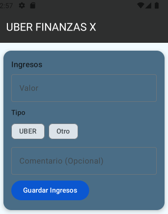
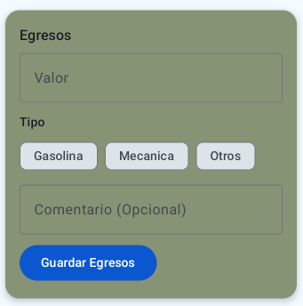
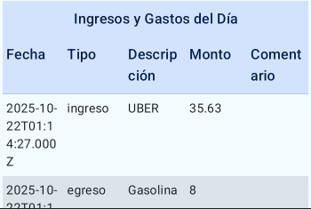
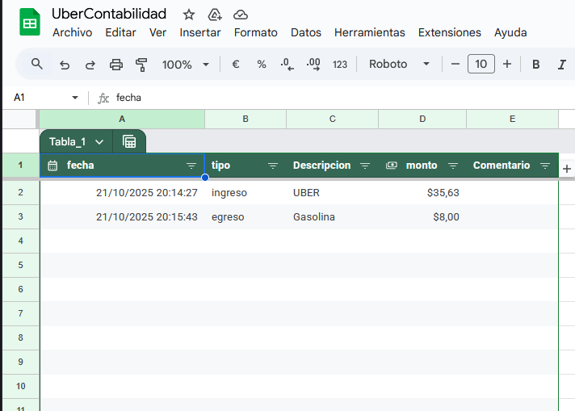

# 🚗 **Uber Financial App**

<p align="center">
  
  
  
</p>

**Uber Financial App** is designed to keep track of the **incomes and outcomes** of a person who works as an **Uber driver**.  
Its main goal is to provide a simple way to **register, visualize, and analyze** daily and monthly financial activity.

---

## 🧩 **App Structure**

The application is composed of **two main composable elements**:

1. 🪪 **Register Card**  
   A card where the user can:
   - Enter the **amount** earned or spent.  
   - Select the **type** (*income* or *outcome*).  
   - Add an optional **comment**.  

2. 📊 **Data Table**  
   A table where the user can:
   - View the **records registered for the current day**.  
   - Display a message when there are **no available records**.  

---

## 🖥️ **Backend Overview**

<p align="center">
  
</p>


The backend is built using **Google Apps Script**, which interacts with a **Google Spreadsheet** to store and retrieve data through HTTP requests (`GET` and `POST`).

---

## ⚙️ **Google Apps Script Backend Code**

```javascript
function doGet(e) {
  const ss = SpreadsheetApp.openById("19X2P6bPSRN29pEdJCXs_ODOiOWvEUzE7zE");
  const sheet = ss.getSheetByName("valores");
  const data = sheet.getDataRange().getValues();
  const mode = e && e.parameter.mode ? e.parameter.mode : 'all';

  try {
    if (mode === 'today') return getTodayData(data);
    if (mode === 'month') return getMonthData(data);
    return getAllData(data);

  } catch (error) {
    return ContentService.createTextOutput(JSON.stringify({
      success: false,
      error: error.toString()
    })).setMimeType(ContentService.MimeType.JSON);
  }
}

// 🔹 Returns all records
function getAllData(data) {
  return createResponse('All records retrieved successfully', data);
}

// 🔹 Filters current day data
function getTodayData(data) {
  const tz = Session.getScriptTimeZone();
  const todayStr = Utilities.formatDate(new Date(), tz, "yyyy-MM-dd");

  const filtered = data.filter((row, index) => {
    if (index === 0) return false; // Skip header
    const fecha = Utilities.formatDate(new Date(row[0]), tz, "yyyy-MM-dd");
    return fecha === todayStr;
  });

  return createResponse('Today’s data retrieved successfully', filtered);
}

// 🔹 Filters current month data and calculates totals
function getMonthData(data) {
  const today = new Date();
  const currentMonth = today.getMonth();
  const currentYear = today.getFullYear();

  const filtered = data.filter((row, index) => {
    if (index === 0) return false;
    const fecha = new Date(row[0]);
    return fecha.getMonth() === currentMonth && fecha.getFullYear() === currentYear;
  });

  // Calculate totals
  let totalIncome = 0;
  let totalOutcome = 0;
  filtered.forEach(row => {
    const type = row[1]?.toLowerCase();
    const amount = Number(row[3]) || 0;
    if (type === 'income') totalIncome += amount;
    else if (type === 'outcome') totalOutcome += amount;
  });

  return createResponse('Monthly data retrieved successfully', filtered, {
    totalIncome,
    totalOutcome,
    balance: totalIncome - totalOutcome
  });
}

// 🔸 Helper: creates a standard JSON response
function createResponse(message, data, extra = {}) {
  return ContentService.createTextOutput(JSON.stringify({
    success: true,
    message,
    data,
    ...extra
  })).setMimeType(ContentService.MimeType.JSON);
}

// 🔹 Handles POST requests to store data
function doPost(e) {
  try {
    var ss = SpreadsheetApp.openById("19X2P6bPSRN29pEdJCXs_ODOiOWvt6zE7zE");
    var sheet = ss.getSheetByName("valores");

    if (!e || !e.postData || !e.postData.contents) {
      throw new Error("No data received");
    }

    // Parse incoming JSON
    var data;
    try {
      data = JSON.parse(e.postData.contents);
    } catch(err) {
      throw new Error("Invalid JSON: " + err.message);
    }

    // Validate required fields
    if (!data.tipo || !data.descripcion || data.monto === undefined) {
      throw new Error("Missing required fields: tipo, descripcion, monto");
    }

    // Optional comment
    var comentario = data.comentario || "";

    // Append new row to the spreadsheet
    sheet.appendRow([new Date(), data.tipo, data.descripcion, data.monto, comentario]);

    return ContentService
      .createTextOutput(JSON.stringify({ success: true, message: "Data saved successfully" }))
      .setMimeType(ContentService.MimeType.JSON);

  } catch (error) {
    return ContentService
      .createTextOutput(JSON.stringify({ success: false, error: error.toString() }))
      .setMimeType(ContentService.MimeType.JSON);
  }
}


